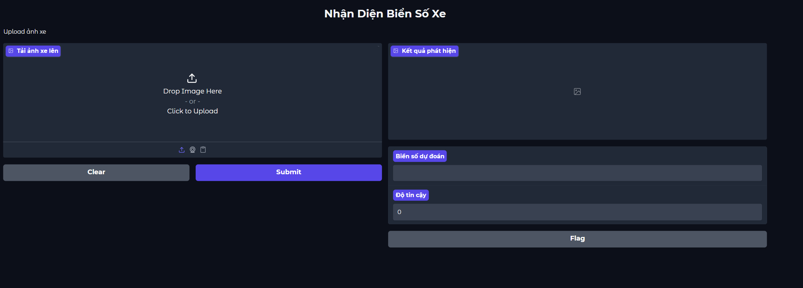
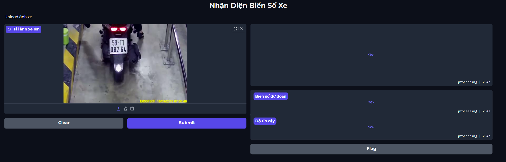
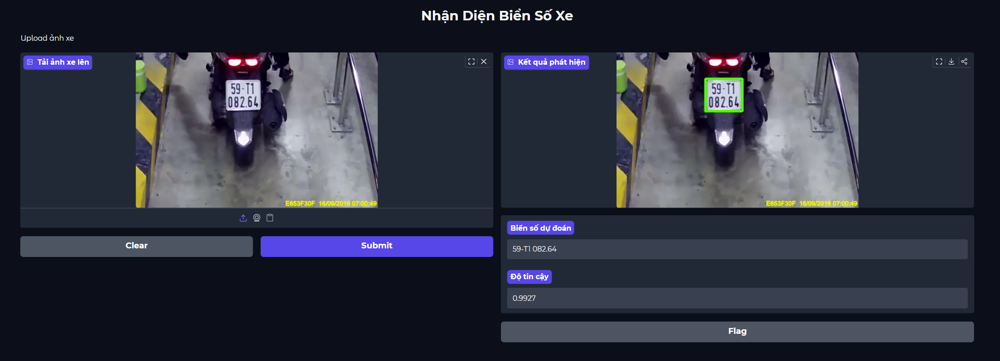

#  Hệ thống nhận diện biển số xe 

- Dự án tập trung vào việc xây dựng hệ thống tự động phát hiện và nhận diện biển số xe tại Việt Nam. 
- Hệ thống sử dụng mô hình phát hiện đối tượng mới nhất YOLOv11 kết hợp với các công cụ OCR mạnh mẽ (EasyOCR, PaddleOCR) để trích xuất thông tin chính xác từ hình ảnh.

## 🔄 Pipeline hệ thống

Input Image → Detection (YOLO) → Crop Plate → OCR → Output Text


---

📂 Cấu trúc thư mục 
- Dưới đây là cấu trúc chi tiết của repository:

``` plaintext
Project-II/
├── data/
│   ├── configs/                      # Chứa file data.yaml cấu hình đường dẫn dataset
│   ├── vietnam-car-license-plate/    # Bộ dữ liệu biển số xe (Bike)
│   └── yolo_dataset/                 # Dữ liệu đã định dạng chuẩn cho YOLO
├── frontend/
│   └── app.py                        # Script chính khởi chạy giao diện người dùng
├── images/                           # Ảnh minh họa cho frontend (upload.png, processing.png, result.png)
├── models/                           
│   ├── ocr/                          
│   │   ├── easyocr_engine.py         # Triển khai nhận diện bằng EasyOCR
│   │   ├── paddleocr_engine.py       # Triển khai nhận diện bằng PaddleOCR
│   │   ├── run_pipeline.py           # Luồng xử lý tích hợp OCR
│   │   ├── metrics.py                # Tính toán độ chính xác của OCR
│   │   ├── convert_location_to_csv.py   # Tạo Ground Truth từ location.txt
│   │   ├── preprocessing.py          # Cải thiện chất lượng ảnh trước khi đưa vào OCR
│   │   ├── yolo_detector.py          # Xử lý chính cho phát hiện đối tượng và cắt vùng ảnh biển số
│   │   └── res_visualization.ipynb   # Trực quan hoá kết quả
│   ├── yolo/                        
│   │   ├── data_preprocessing.ipynb  # Tiền xử lý dữ liệu    
│   │   ├── train_yolo.ipynb          # Notebook huấn luyện mô hình YOLOv11
│   │   ├── YOLO11_Guide.md           # Tài liệu hướng dẫn sử dụng YOLOv11
│   └── └── yolo11n.pt                # Trọng số mô hình đã huấn luyện 
├── runs/
│   └── detect/
│         ├── predict/                # Ảnh mẫu YOLO tự động tạo
│         └── runs_yolo11/
│             ├── plate_detection/   
│             │    └── weights/      # Chứa trọng số mô hình YOLO sau khi train
│             └── yolo_metrics_explanation.md   # Tài liệu giải thích chi tiết các chỉ số đánh giá
├── requirements.txt            
├── README.md
└── .gitignore
```

--- 


## 1. License Plate Detection (YOLO11)
- Phần này chứa toàn bộ quy trình xây dựng mô hình Detection để xác định vị trí biển số xe trong khung hình. 
- Đây là bước tiền đề quan trọng trước khi đưa vùng ảnh biển số vào Module OCR.

### 🛠 Quy trình vận hành 
- Bước 1: Chuẩn bị dữ liệu chuẩn YOLO bằng cách chạy toàn bộ data_preprocessing.ipynb
- Bước 2: Thiết lập cấu hình huấn luyện trong file data.yaml
- Bước 3: Huấn luyện mô hình trong train_yolo.ipynb và lưu best.pt là file trọng số
- Bước 4: Kiểm tra và Đánh giá: Lưu kết quả mẫu vào thư mục runs/detect/predict

---

## 2. License Plate OCR (EasyOCR & PaddleOCR)
- Module này thực hiện việc trích xuất ký tự từ vùng ảnh biển số đã được YOLO phát hiện. 
- Hỗ trợ so sánh hiệu năng giữa hai Engine phổ biến là EasyOCR và PaddleOCR.

### 🛠 Quy trình vận hành 
- Bước 1: Cài đặt thư viện bổ sung

```bash
pip install easyocr paddleocr paddlepaddle          # paddlepaddle-gpu nếu có GPU
```

- Bước 2: Chạy pipeline cho cả hai mô hình (both) hoặc các mô hình riêng lẻ, --debug nếu muốn hiển thị chi tiết kết quả từng ảnh
```bash
python run_pipeline.py [--engine {easyocr,paddleocr,both}] [--debug]
```

- VÍ DỤ: 

```bash
python run_pipeline.py --engine both --debug
```

- Bước 3: Trực quan hoá kết quả: File data_visualization.ipynb giúp trực quan hoá so sánh Độ chính xác và Hiệu năng

--- 

## 3. Demo – Hệ thống nhận diện biển số xe

### Tổng quan
Demo này trình bày cách sử dụng ứng dụng web để nhận diện biển số xe máy tại Việt Nam bằng mô hình YOLO kết hợp với PaddleOCR.  

Hệ thống có tích hợp các kỹ thuật xử lý ảnh như:
- Làm nét ảnh  
- Cân bằng ánh sáng  

Người dùng có thể tải ảnh lên giao diện web và hệ thống sẽ tự động phát hiện và đọc nội dung biển số.

### Yêu cầu môi trường
Cài đặt các thư viện cần thiết:

```bash
pip install ultralytics paddleocr paddlepaddle gradio opencv-python numpy
```

### Cách chạy demo
Bước 1: Khởi chạy ứng dụng
```bash
python -m frontend.app
```


Bước 2: Mở giao diện web
Sau khi chạy, mở trình duyệt và truy cập:
http://127.0.0.1:7860

Bước 3: Sử dụng hệ thống
1. Nhấn vào Upload để chọn ảnh

2. Chờ hệ thống xử lý (vài giây)

3. Xem kết quả hiển thị


### Kết quả đầu ra
Hệ thống sẽ trả về:
- Vị trí biển số (bounding box)
- Nội dung biển số
- Độ tin cậy (confidence)

