#  Hệ thống nhận diện biển số xe 
---
## 1. Giới thiệu

- **Bài toán:** Nhận diện biển số xe (Automatic License Plate Recognition - ALPR) là bài toán ứng dụng thị giác máy tính (Computer Vision) nhằm tự động định vị, cắt vùng chứa biển số và trích xuất các ký tự quang học (OCR) trên biển số xe từ hình ảnh hoặc video. Đây là một bài toán khó đòi hỏi sự kết hợp của nhiều mô hình do sự đa dạng về điều kiện ánh sáng, góc chụp hẹp, ảnh mờ, bị che khuất và sự khác biệt về loại biển số (biển 1 dòng, 2 dòng, ô tô, xe máy, biển vuông, dài,...).
  
- **Ứng dụng thực tế:**
  - **Quản lý bãi đỗ xe:** Tự động hóa quá trình ghi nhận xe ra vào, tính phí, kiểm soát phương tiện tại chung cư, trung tâm thương mại.
  - **Giao thông thông minh:** Hệ thống thu phí không dừng (ETC), giám sát lưu lượng, điều phối giao thông tự động.
  - **Giám sát an ninh:** Hỗ trợ phạt nguội vi phạm giao thông (vượt đèn đỏ, lấn làn), tìm kiếm xe mất cắp hoặc xe vi phạm pháp luật.
  - **Quản lý nội bộ:** Kiểm soát phương tiện ra vào tại các cơ quan, trường học, khu công nghiệp.

---
## 2. Dataset
- **Nguồn dữ liệu:** https://www.kaggle.com/datasets/nampham79/vietnam-car-license-plate
- **Số lượng ảnh:** Hơn 1700+ hình ảnh biển số xe máy với nhiều điều kiện ánh sáng, góc chụp và môi trường khác nhau.
- **Ví dụ minh họa:**
  <br>
  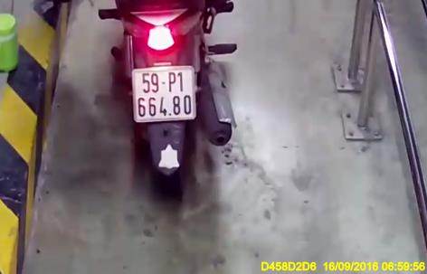
- Dự án tập trung vào việc xây dựng hệ thống tự động phát hiện và nhận diện biển số xe tại Việt Nam. 
- Hệ thống sử dụng mô hình phát hiện đối tượng mới nhất YOLOv11 kết hợp với các công cụ OCR mạnh mẽ (EasyOCR, PaddleOCR) để trích xuất thông tin chính xác từ hình ảnh.

---
## 3. Pipeline hệ thống và cấu trúc thư mục

Input Image → Detection (YOLO) → Crop Plate → OCR → Output Text


---

📂 **Cấu trúc thư mục**
- Dưới đây là cấu trúc chi tiết của repository:

``` plaintext
Project-II/
├── data/
│   ├── configs/                      # Chứa file data.yaml cấu hình đường dẫn dataset
│   ├── vietnam-car-license-plate/    # Bộ dữ liệu biển số xe (Bike)
│   └── yolo_dataset/                 # Dữ liệu đã định dạng chuẩn cho YOLO
├── frontend/
│   └── app.py                        # Script chính khởi chạy giao diện người dùng
├── images/                           # Ảnh minh họa cho frontend (upload.png, processing.png, result.png)
├── models/                           
│   ├── ocr/                          
│   │   ├── easyocr_engine.py         # Triển khai nhận diện bằng EasyOCR
│   │   ├── paddleocr_engine.py       # Triển khai nhận diện bằng PaddleOCR
│   │   ├── run_pipeline.py           # Luồng xử lý tích hợp OCR
│   │   ├── metrics.py                # Tính toán độ chính xác của OCR
│   │   ├── convert_location_to_csv.py   # Tạo Ground Truth từ location.txt
│   │   ├── preprocessing.py          # Cải thiện chất lượng ảnh trước khi đưa vào OCR
│   │   ├── yolo_detector.py          # Xử lý chính cho phát hiện đối tượng và cắt vùng ảnh biển số
│   │   └── res_visualization.ipynb   # Trực quan hoá kết quả
│   ├── yolo/                        
│   │   ├── data_preprocessing.ipynb  # Tiền xử lý dữ liệu    
│   │   ├── train_yolo.ipynb          # Notebook huấn luyện mô hình YOLOv11
│   │   ├── YOLO11_Guide.md           # Tài liệu hướng dẫn sử dụng YOLOv11
│   └── └── yolo11n.pt                # Trọng số mô hình đã huấn luyện 
├── runs/
│   └── detect/
│         ├── predict/                # Ảnh mẫu YOLO tự động tạo
│         └── runs_yolo11/
│             ├── plate_detection/   
│             │    └── weights/      # Chứa trọng số mô hình YOLO sau khi train
│             └── yolo_metrics_explanation.md   # Tài liệu giải thích chi tiết các chỉ số đánh giá
├── requirements.txt            
├── README.md
└── .gitignore
```

--- 

## 4. License Plate Detection (YOLO11)
- Phần này chứa toàn bộ quy trình xây dựng mô hình Detection để xác định vị trí biển số xe trong khung hình. 
- Đây là bước tiền đề quan trọng trước khi đưa vùng ảnh biển số vào Module OCR.

### 🛠 Quy trình vận hành 
- **Bước 1:** Chuẩn bị dữ liệu chuẩn YOLO bằng cách chạy toàn bộ data_preprocessing.ipynb
- **Bước 2:** Thiết lập cấu hình huấn luyện trong file data.yaml
- **Bước 3:** Huấn luyện mô hình trong train_yolo.ipynb và lưu best.pt là file trọng số
- **Bước 4:** Kiểm tra và Đánh giá: Lưu kết quả mẫu vào thư mục runs/detect/predict

---

## 5. License Plate OCR (EasyOCR & PaddleOCR)
- Module này thực hiện việc trích xuất ký tự từ vùng ảnh biển số đã được YOLO phát hiện. 
- Hỗ trợ so sánh hiệu năng giữa hai Engine phổ biến là EasyOCR và PaddleOCR.

### 🛠 Quy trình vận hành 
- **Bước 1:** Cài đặt thư viện bổ sung

```bash
pip install easyocr paddleocr paddlepaddle          # paddlepaddle-gpu nếu có GPU
```

- **Bước 2:** Chạy pipeline cho cả hai mô hình (both) hoặc các mô hình riêng lẻ, --debug nếu muốn hiển thị chi tiết kết quả từng ảnh
```bash
python -m models.ocr.run_pipeline [--engine {easyocr,paddleocr,both}] [--debug]
```

#### Kết quả EasyOCR:

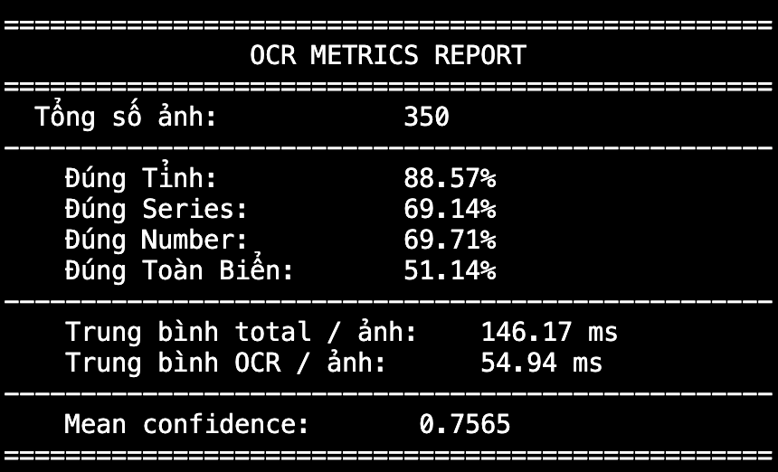

#### Kết quả PaddleOCR: 

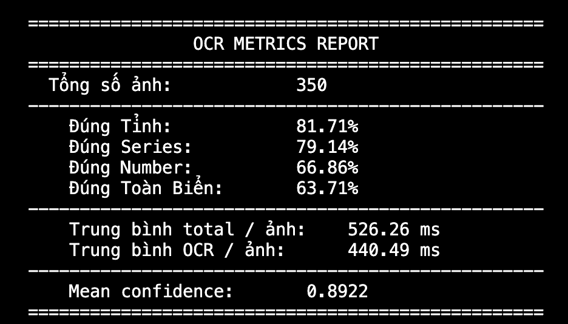

- VÍ DỤ: 

```bash
python -m models.ocr.run_pipeline --engine both --debug
```


- **Bước 3:** Trực quan hoá kết quả: File data_visualization.ipynb giúp trực quan hoá so sánh Độ chính xác và Hiệu năng

#### Độ chính xác tổng thể:

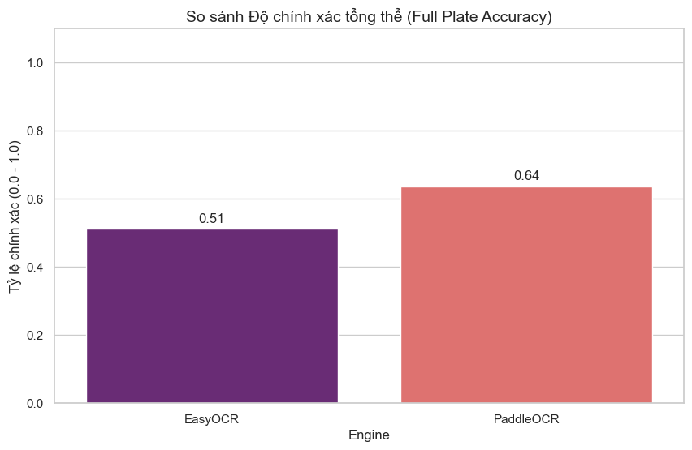

#### Độ chính xác thành phần

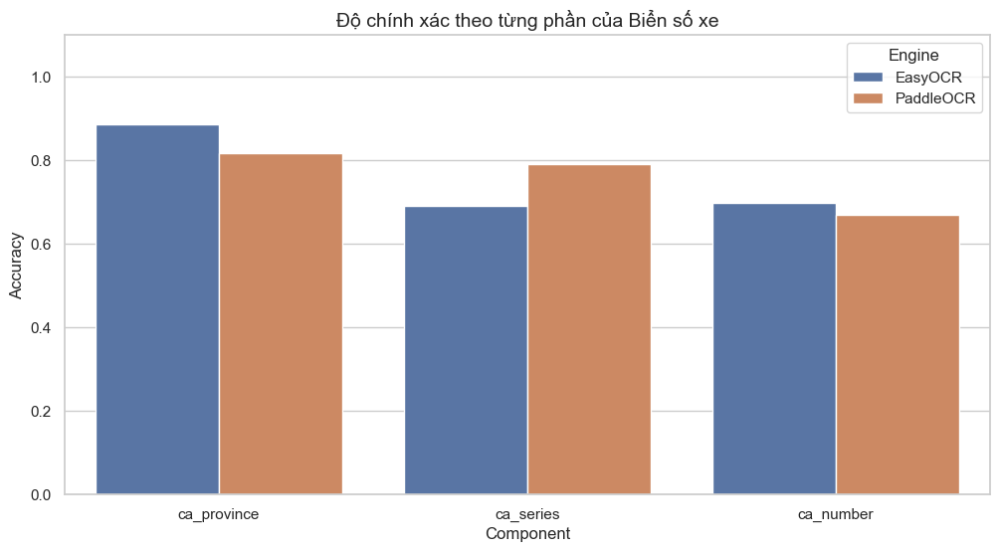

--- 

## 6. Demo – Hệ thống nhận diện biển số xe

### Tổng quan
Demo này trình bày cách sử dụng ứng dụng web để nhận diện biển số xe máy tại Việt Nam bằng mô hình YOLO kết hợp với PaddleOCR.  

Hệ thống có tích hợp các kỹ thuật xử lý ảnh như:
- Làm nét ảnh  
- Cân bằng ánh sáng  

Người dùng có thể tải ảnh lên giao diện web và hệ thống sẽ tự động phát hiện và đọc nội dung biển số.

### Yêu cầu môi trường
Cài đặt các thư viện cần thiết:

```bash
pip install -r requirements.txt
```

### Cách chạy demo
**Bước 1:** Khởi chạy ứng dụng
```bash
python -m frontend.app
```


**Bước 2:** Mở giao diện web
Sau khi chạy, mở trình duyệt và truy cập:
http://127.0.0.1:7860

**Bước 3:** Sử dụng hệ thống
1. Nhấn vào Upload để chọn ảnh

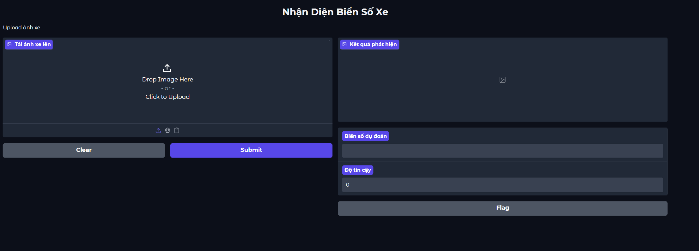

2. Chờ hệ thống xử lý (vài giây)

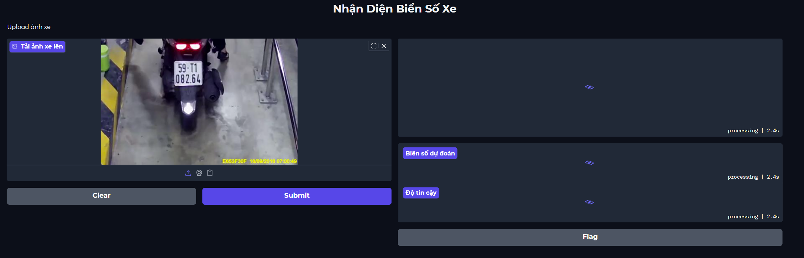

3. Xem kết quả hiển thị

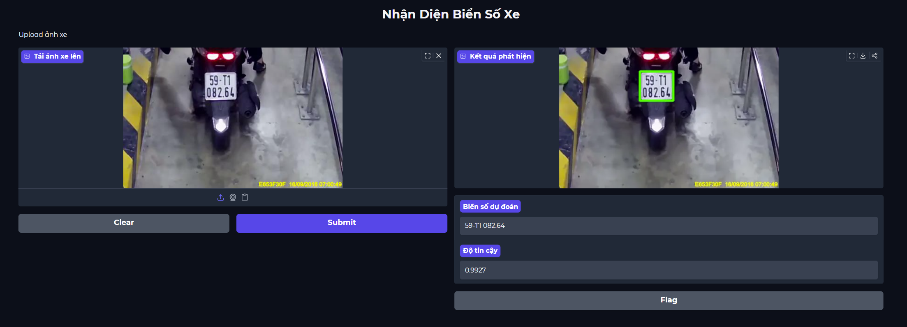

---

## 7. Đánh giá & Phân tích lỗi
### 7.1 Đánh giá hiệu năng

Dưới đây là bảng so sánh chi tiết giữa hai OCR Engine: EasyOCR và PaddleOCR dựa trên các chỉ số chính xác thành phần và hiệu năng thời gian xử lý.


| Chỉ số đánh giá (Metrics)        | EasyOCR | PaddleOCR | Winner          |
|---------------------------------|--------:|----------:|-----------------|
| CA Province (Tỉnh thành)        | 88.57%  | 81.71%    |  EasyOCR      |
| CA Series (Số seri)             | 69.14%  | 79.14%    |  PaddleOCR    |
| CA Number (Số thứ tự)           | 69.71%  | 66.86%    |  EasyOCR      |
| CA Full (Toàn bộ biển)          | 51.14%  | 63.71%    |  PaddleOCR    |
| Mean Confidence                 | 0.7565  | 0.8922    |  PaddleOCR    |
| Mean Total Time (ms)            | 144.21  | 775.19    |  EasyOCR      |
| Mean OCR Inference (ms)         | 54.66   | 634.29    |  EasyOCR      |

### Nhận xét:

- Độ chính xác (Accuracy): 
  - PaddleOCR vượt trội hơn ở chỉ số quan trọng nhất là CA Full (63.71%), cho thấy khả năng nhận diện toàn chuỗi ký tự ổn định hơn.
  - EasyOCR lại làm tốt hơn ở việc tách biệt các thành phần đơn lẻ như Tỉnh thành và Số thứ tự.

- Tốc độ (Speed):
  - EasyOCR có lợi thế cực lớn về thời gian xử lý (~54ms so với ~634ms của PaddleOCR). 
  - PaddleOCR mặc dù chậm hơn nhưng mang lại độ tin cậy cao hơn cho các bài toán cần sự chính xác tuyệt đối.

### 7.2 Phân tích lỗi

#### 1. Lỗi do lệch phân phối dữ liệu 
- Vấn đề: Bộ dữ liệu GreenParking chủ yếu chứa ảnh từ camera an ninh cố định với góc nhìn từ trên cao, khoảng cách từ camera đến xe ổn định.
- Hệ quả: Khi đưa vào các ảnh chụp cận cảnh, nơi biển số chiếm > 80% diện tích khung hình, mô hình YOLOv11 sẽ không nhận diện được bounding box do thiếu các đặc trưng ngữ cảnh xung quanh biển số.
- Minh họa:

- Ảnh chuẩn: Xe cách camera 2-3m -> Detection tốt.
  


- Ảnh lỗi: Biển số tràn khung -> Detection fail.

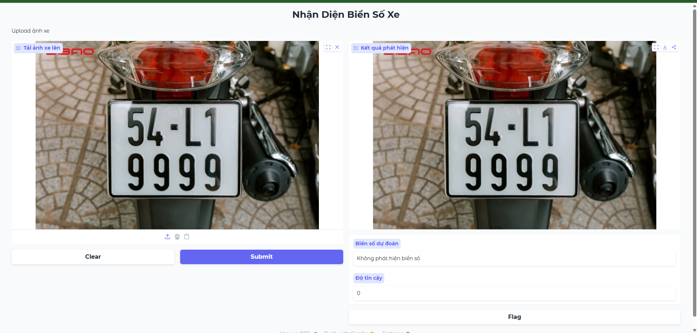

#### 2. Chiến lược dự phòng
- Để khắc phục lỗi trên, hệ thống triển khai logic: Nếu mô hình YOLO không trả về kết quả (Confidence < threshold) hoặc vùng cắt (crop) có tỉ lệ không hợp lý, hệ thống sẽ tự động Fallback. 
 
1. **Kích hoạt Fallback:** Nếu YOLO không tìm thấy bất kỳ biển số nào trong ảnh, hệ thống sẽ tự động kích hoạt luồng dự phòng.
2. **Quét toàn bộ ảnh:** Bỏ qua bước cắt vùng biển số (crop & padding), hệ thống sẽ đưa trực tiếp **toàn bộ bức ảnh gốc** vào engine PaddleOCR để quét tìm tất cả các đoạn văn bản có trong ảnh.
3. **Tổng hợp kết quả:** 
   - Nếu OCR không tìm thấy bất kỳ chữ nào, hệ thống trả về thông báo *"Không phát hiện biển số"*.
   - Nếu tìm thấy, hệ thống sẽ tự động nối tất cả các cụm chữ lại với nhau để tạo thành kết quả cuối cùng và tính toán độ tin cậy trung bình.
4. **Trực quan hóa:** Để người dùng dễ dàng phân biệt, kết quả từ luồng dự phòng sẽ được vẽ bằng các **khung đa giác màu CAM** bao quanh chữ (thay vì khung chữ nhật màu XANH LÁ của luồng YOLO chuẩn).

- Ảnh sau khi khắc phục:

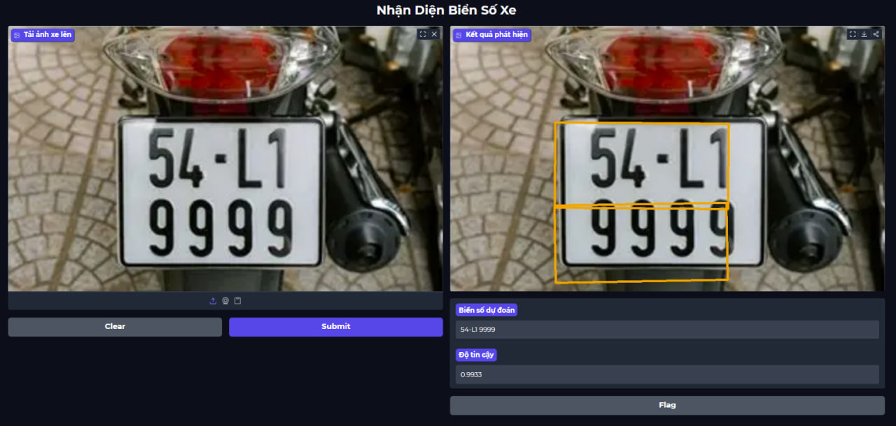

#### 3. Các lỗi ngoại cảnh khác và sự cần thiết khi chọn lựa padding
- Điều kiện ánh sáng: Biển số bị chói đèn pha hoặc quá tối trong hầm xe.
- Mô hình YOLO cắt quá sát biển số, cắt quá sâu vào phần biển làm cho OCR không đọc được đầy đủ ký tự

- Minh hoạ như hình bên dưới:

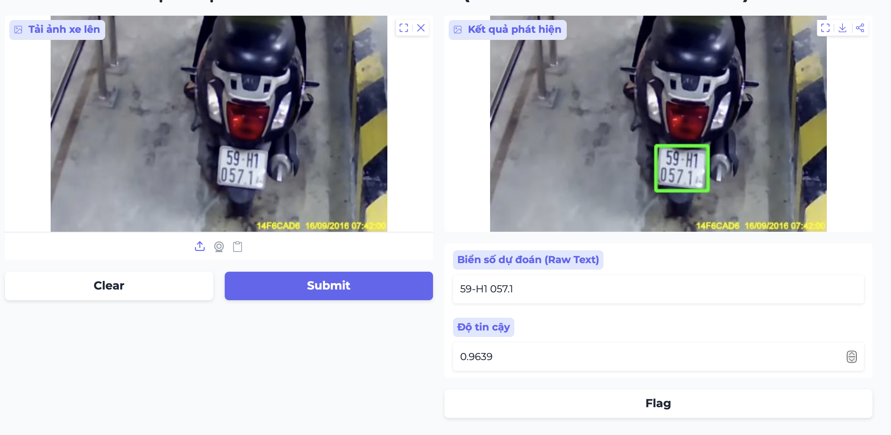

## 8. Một vài kỹ thuật giúp cải thiện hiệu năng và độ chính xác
### 8.1 Lựa chọn padding phù hợp
- Việc cắt ảnh biển số (crop) dựa trên kết quả của YOLO thường rất sát với biên của biển. Tuy nhiên, điều này gây ra hai vấn đề lớn cho giai đoạn OCR:

  - Mất mát thông tin biên: Trong các trường hợp biển số bị nghiêng (tilt) hoặc góc chụp không trực diện, việc cắt sát sẽ khiến các ký tự ở rìa bị mất một phần nét, dẫn đến nhận diện sai (ví dụ: số 0 thành C, số 8 thành 3).

  - Thiếu ngữ cảnh cho mô hình: OCR cần một khoảng không gian trắng nhỏ xung quanh để định vị chính xác vị trí bắt đầu và kết thúc của ký tự.

- Giải pháp: Áp dụng Padding mở rộng (thường từ 5-10% diện tích BBX) trước khi đưa vào mô hình nhận diện. Điều này giúp bảo toàn nguyên vẹn các nét của ký tự ngay cả khi biển số có độ biến dạng nhất định.

### 8.2 Cơ chế giải mã CTC (Connectionist Temporal Classification) trong EasyOCR
- EasyOCR sử dụng kiến trúc mạng CRNN (Convolutional Recurrent Neural Network) kết hợp với tầng giải mã CTC.

- Đặc điểm: Khi mô hình quét qua một tấm ảnh biển số, nó không dự đoán ngay lập tức từng chữ cái. Thay vào đó, nó chia ảnh thành nhiều khung hình (frames) nhỏ theo chiều ngang. Mỗi khung hình sẽ trả về một dự đoán (ví dụ: 6, 6, -, 6, 6, 6, -, 3, 3).

- Xử lý đặc biệt: Để có kết quả cuối cùng là 63, hệ thống thực hiện hai bước:

  - Dồn các ký tự lặp: Loại bỏ các ký tự giống nhau đứng cạnh nhau.

  - Loại bỏ ký tự trống (blank): Xóa các ký tự - được dùng để phân tách.

- Hiện tượng nhân bản sinh số thừa: Mô hình quét qua ảnh theo từng cửa sổ trượt (sliding window). Nếu một ký tự có chiều ngang lớn hoặc xe di chuyển chậm, mô hình có thể nhận diện ký tự đó nhiều lần tại các vị trí kề nhau.

- Ví dụ: Một biển số đúng là 26 có thể bị dự đoán nhầm thành chuỗi: [2, 2, <blank>, 2, 6, 6]. Nếu chỉ áp dụng thuật toán gom cụm (collapsing) cơ bản của CTC, kết quả trả về sẽ là 226 thay vì 26, gây ra sai số nghiêm trọng trong việc tra cứu biển số.

- Tối ưu hóa: Trong mã nguồn, chúng tôi đã tinh chỉnh hàm hậu xử lý để lọc nhiễu, đặc biệt là xử lý dấu gạch ngang giữa biển số xe Việt Nam (ví dụ: 59-C1) để tránh mô hình nhầm lẫn với các ký tự rác.

### 8.3 Xử lý theo lô


### 8.4 Kết quả thực nghiệm sau khi áp dụng các kỹ thuật

- Sau khi triển khai các kỹ thuật trên, hệ thống ghi nhận những cải thiện đáng kể:

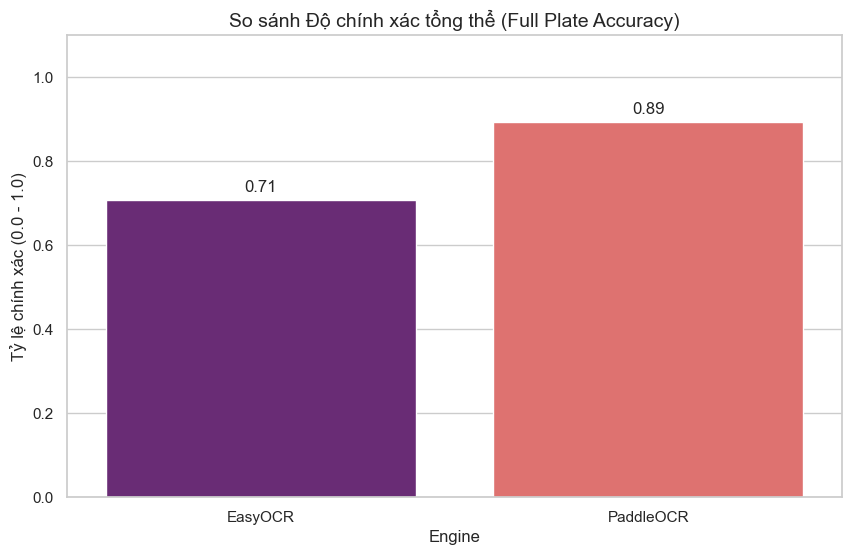

- Bảng so sánh Độ chính xác và Hiệu năng
 - EasyOCR

| Chỉ số / Thành phần | EasyOCR Baseline | EasyOCR Optimized | Cải thiện |
|---|---|---|---|
| Đúng Tỉnh | 88.57% | 93.71% | ↑ 5.14% |
| Đúng Series | 69.14% | 77.43% | ↑ 8.29% |
| Đúng Number | 69.71% | 88.57% | ↑ 18.86% |
| Đúng Toàn Biển | 51.14% | 70.86% | ↑ 19.72% |
| Mean Confidence | 0.7565 | 0.8039 | ↑ 0.0474 |
| Trung bình OCR / ảnh | 54.94 ms | 211.25 ms | ↑ 156.31 ms |
| Trung bình Total / ảnh | 146.17 ms | 296.23 ms | ↑ 150.06 ms |

  - PaddleOCR 

| Chỉ số (Metrics) | PaddleOCR | Optimized PaddleOCR | Cải thiện |
|---|---|---|---|
| Đúng Tỉnh | 81.71% | 92.57% | ↑ 10.86% |
| Đúng Series | 79.14% | 91.43% | ↑ 12.29% |
| Đúng Number | 66.86% | 90.00% | ↑ 23.14% |
| Đúng Toàn Biển | 63.71% | 89.43% | ↑ 25.72% |
| Mean Confidence | 0.8922 | 0.9523 | ↑ 0.0601 |
| Trung bình OCR / ảnh | 440.49 ms | 537.59 ms | ↑ 97.10 ms |
| Trung bình total / ảnh | 526.26 ms | 623.70 ms | ↑ 97.44 ms |

- Nhận xét: Thời gian xử lý tăng do các trường hợp YOLO không phát hiện được biển số sẽ được chuyển sang PaddleOCR để xử lý toàn ảnh (fallback OCR), giúp tăng accuracy nhưng làm tăng latency.

